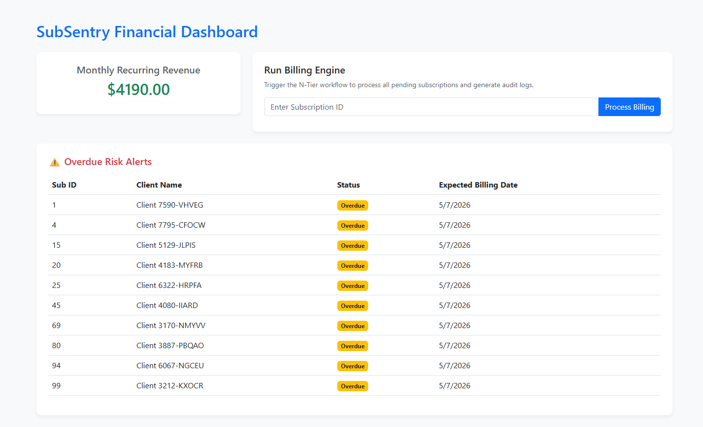
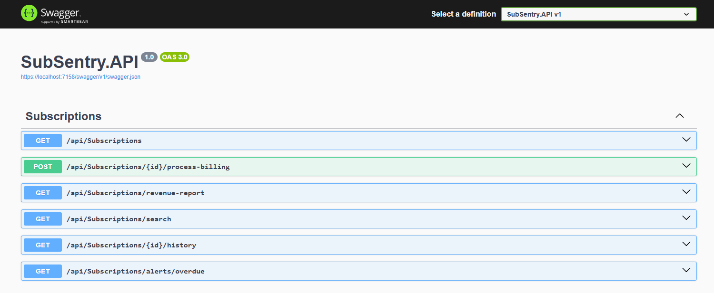

# 🛡️ SubSentry API - FinTech Subscription Engine

SubSentry is a high-performance RESTful Web API designed to handle complex financial workflows, subscription billing cycles, and automated risk analysis. 

## 📸 Project Showcase

## 🏗️ Architecture & Standards
This project strictly adheres to enterprise-level design patterns:
* **N-Tier Architecture:** Complete physical and logical separation between the Presentation Layer (API), Business Logic Layer (BLL), and Data Access Layer (DAL).
* **SOLID Principles:** Heavy reliance on Dependency Inversion (Interface-driven services) and Single Responsibility (isolated workflow triggers).
* **Data Integrity:** Implements cycle-breaking JSON serialization to handle complex relational data graphs securely.

## 🚀 Key Functionalities
1. **Financial Analytics Dashboard:** Aggregates and calculates Monthly Recurring Revenue (MRR) dynamically.
2. **Workflow Automation:** 'Dunning' logic that advances billing cycles and updates subscription states upon successful processing.
3. **Advanced Filtering Engine:** Multi-criteria search endpoints capable of pinpointing high-value or specific-status accounts.
4. **Risk Alert System:** Automated scanning that flags past-due accounts for immediate intervention.
5. **Immutable Audit Logging:** Regulatory compliance feature that automatically records all historical state changes into a dedicated ledger.

## 📊 Data Engineering Integration
To simulate a production environment, the database seeder is engineered to ingest the **Telco Customer Churn** dataset (sourced from Kaggle). On startup, the API dynamically parses the CSV, maps real-world churn metrics to C# entities, and populates the SQL Server.
